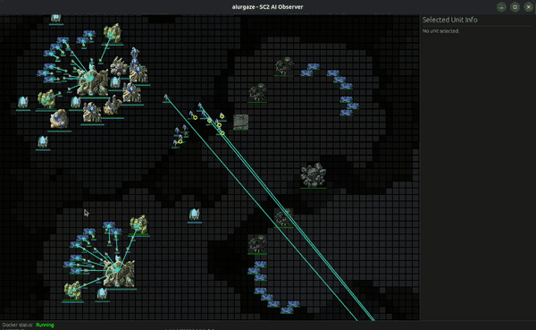

[](https://stand-with-ukraine.pp.ua)

# aiurgaze




A standalone StarCraft II game viewer and launcher built with the [Bevy](https://bevy.org/) game engine. It runs a headless SC2 instance in Docker, creates games for your bots (Vs AI or bot vs bot), and visualizes them.

The project takes the same core idea as the VS Code extension [StarCraft II for VSCode](https://marketplace.visualstudio.com/items?itemName=stephanzlatarev.vscode-starcraft), but focuses on:

- **Better performance**: Bevy provides faster rendering and responsiveness than Node.js-based alternatives.
- Running as a **standalone app** (no VS Code dependency).

Tested on Ubuntu 25.04; should work on any platform where Rust and Docker are available.

---

## Installation & Build

### Prerequisites

- **Rust toolchain** https://rustup.rs/.
- **Docker** installed and running.
  - The user running `aiurgaze` should be able to run `docker` commands (be in the `docker` group on Linux).

### Build the Rust binary

From the project root:

```bash
cargo build --release
```

The compiled binary will be at:

```bash
target/release/aiurgaze
```

### Install for current user via `install.sh`

You can install `aiurgaze` system-wide using the provided script:

```bash
./install.sh
```

This will:

- Build and install the binary to `~/.cargo/bin/aiurgaze` using `cargo install`.
- Copy configuration to `~/.config/aiurgaze/config.toml` (XDG config directory).
- Copy assets, data, and maps to `~/.local/share/aiurgaze/` (XDG data directory).

The application follows the [XDG Base Directory Specification](https://specifications.freedesktop.org/basedir-spec/basedir-spec-latest.html), so it will automatically find its files after installation.

**Note**: Make sure `~/.cargo/bin` is in your `PATH` to run `aiurgaze` from anywhere.

### Pull the SC2 Docker image (hosted)

The app expects a hosted SC2 headless image and pulls it on startup. You can also pre-pull manually:

```bash
docker pull ghcr.io/kubivan/aiurgaze-sc2:latest
```

You can customize the image name/tag in `config.toml` (see `[starcraft]` section below).

### Build the SC2 Docker image

The app expects a minimal SC2 headless image called `minimal-sc2` by default. Build it from the `docker/` directory:

```bash
cd docker
docker build -t minimal-sc2 .
```

You can customize the image name in `config.toml` (see `[starcraft]` section below).

---

## Usage

`aiurgaze` can be used in two main ways:

1. **UI mode** - start the app and configure everything in the UI, using `config.toml` as defaults.
2. **CLI-assisted mode** - use a subcommand to preconfigure game mode and race, then let the UI open directly into a ready-to-play game.

### 1. UI mode

Run the installed binary:

```bash
aiurgaze
```

Or, from the project root during development:

```bash
cargo run --release
```

You can adjust many settings directly in the UI without touching `config.toml`; the file simply provides the starting defaults.

### 2. CLI-assisted mode (`create_game`)

To skip some manual UI steps and preconfigure the game type and race, use the `create_game` subcommand:

```bash
aiurgaze create_game --mode vsAI --race terran
aiurgaze create_game --mode vsBot --race protoss
```

- `--mode` accepts `vsAI` or `vsBot` (case-insensitive).
- `--race` accepts `terran`, `zerg`, `protoss`, or `random` (case-insensitive).

Behavior:

1. `aiurgaze` starts the SC2 Docker container using `[starcraft]` settings.
2. It loads `config.toml` and uses your chosen `mode` and `race` to override `game_type` and player race.
3. All other settings (map, difficulty, bot commands, etc.) still come from `config.toml`.
4. The Bevy UI starts and immediately creates a game using this configuration.

This is useful when repeatedly running the same game setup from a script or terminal, while still benefiting from the visualization and UI.

## Configuration

The main configuration file is `config.toml`. The application looks for it in the following locations (in order):

1. `./config.toml` (current directory - for development)
2. `~/.config/aiurgaze/config.toml` (XDG config directory - after installation)

This file controls window settings, how the SC2 backend is started, and default game parameters.

### Window settings

```toml
[window]
width = 1920.0
height = 1080.0
resizable = true
```

- `width`, `height`: Initial window size in pixels.
- `resizable`: Whether the window can be resized.

### StarCraft II backend

```toml
[starcraft]
upstream_url = "ws://127.0.0.1"
upstream_port = 5555
listen_url = "127.0.0.1"
listen_port = 5000
image = "ghcr.io/kubivan/aiurgaze-sc2:latest"
container_name = "aiurgaze-sc2"
```

- `upstream_url`, `upstream_port`: Where `aiurgaze` connects to the SC2 WebSocket API inside the container.
- `listen_url`, `listen_port`: Local address the proxy listens on.
- `image`: Name (and tag) of the SC2 Docker image. Defaults to `ghcr.io/kubivan/aiurgaze-sc2:latest`.
- `container_name`: Name for the SC2 container, used when starting/stopping.

The app will:

1. Try to stop any existing container with `container_name`.
2. Run a new container from `image`, exposing the SC2 API port and mounting your maps directory.

### Game configuration panel defaults

```toml
[game_config_panel]
# "VsAI" or "VsBot"
game_type = "VsAI"

# Default map name (file under ./maps)
map_name = "AbyssalReefAIE.SC2Map"

player_name = "Player1"
ai_difficulty = "Medium"   # e.g. "VeryEasy", "Easy", "Medium", "Hard", "Cheat"
ai_race = "Random"          # "Terran", "Zerg", "Protoss", or "Random"

bot_name = "BotOpponent"

disable_fog = true
random_seed = 42
realtime = false

# Shell command to run player bot (if non-empty)
bot_command = "cd ~/src/sc2hs && stack run -- join"

# Shell command to run opponent bot in VsBot mode (if non-empty)
bot_opponent_command = ""
```

These values are used as defaults for the in-app game configuration panel:

- `game_type`: `VsAI` for playing against built-in SC2 AI, or `VsBot` for bot-vs-bot matches.
- `map_name`: Filename of a `.SC2Map` file under `./maps` (see below).
- `player_name`: Name used for your participant.
- `ai_difficulty`: Difficulty for the SC2 AI opponent.
- `ai_race`: Race for the AI opponent.
- `bot_name`: Label for the opponent bot in VsBot mode.
- `disable_fog`: If `true`, fog of war is disabled in the view.
- `random_seed`: Seed used for deterministic game setup (where possible).
- `realtime`: If `true`, the game runs in realtime mode; otherwise, it advances step-by-step.
- `bot_command`: Shell command to start your own bot process. If set, it is run when a game starts.
- `bot_opponent_command`: Shell command to start the opponent bot in VsBot mode. Only used in `VsBot` games.

Commands are executed on the host via the system shell. Make sure any paths, virtual environments or tools referenced in these commands exist and are reachable.

### Maps directory

StarCraft II maps should be placed in a `maps` directory. The application looks for maps in:

1. `./maps/` (current directory - for development)
2. `~/.local/share/aiurgaze/maps/` (XDG data directory - after installation)

For example, after installation:

```text
~/.cargo/bin/aiurgaze
~/.config/aiurgaze/config.toml
~/.local/share/aiurgaze/
  maps/
    AbyssalReefAIE.SC2Map
    OtherMap.SC2Map
  assets/
  data/
```

The Docker container mounts the maps directory into its SC2 installation and the UI lists these map files by name. To change the default map, update `map_name` in `config.toml` to one of the filenames in your maps directory.

---

## Roadmap / Future Work

Some ideas for where `aiurgaze` can go next:

- **UI / UX improvements**
  - Better layout, theming, and usability of the configuration panel and viewer.

- **More debugging capabilities**
  - Richer overlays for unit orders, paths, and combat.
  - Log panels for bot output and SC2 events.

- **SC2 debug API support**
  - Integration with the StarCraft II debug API for drawing overlays and inspecting internal state.

- **Non-realtime stepping**
  - Forward/backward stepping controls when `realtime = false`, to inspect key moments in a game.

Feedback, issues, and pull requests are welcome.

---

## Acknowledgements

* My deepest gratitude to the to the [Security and Defense Forces of Ukraine](https://army.gov.ua/) for keeping us safe and protecting our homes - their service made this project possible.
* Thanks to the [VS Code StarCraft II extension](https://github.com/stephanzlatarev/vscode-starcraft) for inspiration and ideas that shaped this project.
* [StarCraft II API](https://github.com/Blizzard/s2client-proto) - the underlying protocol and client library.
* [BLIZZARD® STARCRAFT® II AI AND MACHINE LEARNING LICENSE](https://blzdistsc2-a.akamaihd.net/AI_AND_MACHINE_LEARNING_LICENSE.html)
